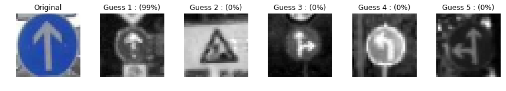

# Self-Driving Car Engineer Nanodegree

## Deep Learning

## Project: Build a Traffic Sign Recognition Classifier

In this notebook, a template is provided for you to implement your functionality in stages, which is required to successfully complete this project. If additional code is required that cannot be included in the notebook, be sure that the Python code is successfully imported and included in your submission if necessary. 

> **Note**: Once you have completed all of the code implementations, you need to finalize your work by exporting the iPython Notebook as an HTML document. Before exporting the notebook to html, all of the code cells need to have been run so that reviewers can see the final implementation and output. You can then export the notebook by using the menu above and navigating to  \n",
    "**File -> Download as -> HTML (.html)**. Include the finished document along with this notebook as your submission. 

In addition to implementing code, there is a writeup to complete. The writeup should be completed in a separate file, which can be either a markdown file or a pdf document. There is a [write up template](https://github.com/udacity/CarND-Traffic-Sign-Classifier-Project/blob/master/writeup_template.md) that can be used to guide the writing process. Completing the code template and writeup template will cover all of the [rubric points](https://review.udacity.com/#!/rubrics/481/view) for this project.

The [rubric](https://review.udacity.com/#!/rubrics/481/view) contains "Stand Out Suggestions" for enhancing the project beyond the minimum requirements. The stand out suggestions are optional. If you decide to pursue the "stand out suggestions", you can include the code in this Ipython notebook and also discuss the results in the writeup file.


>**Note:** Code and Markdown cells can be executed using the **Shift + Enter** keyboard shortcut. In addition, Markdown cells can be edited by typically double-clicking the cell to enter edit mode.

---
## Step 0: Load The Data


```python
# Load pickled data
#“Pickling” is the process whereby a Python object hierarchy is converted into a byte stream
import pickle

#Fill this in based on where you saved the training and testing data

training_file = "train.p"
validation_file= "valid.p"
testing_file = "test.p"

with open(training_file, mode='rb') as f:
    train = pickle.load(f)
with open(validation_file, mode='rb') as f:
    valid = pickle.load(f)
with open(testing_file, mode='rb') as f:
    test = pickle.load(f)
    
X_train, y_train = train['features'], train['labels']
X_valid, y_valid = valid['features'], valid['labels']
X_test, y_test = test['features'], test['labels']
```

---

## Step 1: Dataset Summary & Exploration

The pickled data is a dictionary with 4 key/value pairs:

- `'features'` is a 4D array containing raw pixel data of the traffic sign images, (num examples, width, height, channels).
- `'labels'` is a 1D array containing the label/class id of the traffic sign. The file `signnames.csv` contains id -> name mappings for each id.
- `'sizes'` is a list containing tuples, (width, height) representing the original width and height the image.
- `'coords'` is a list containing tuples, (x1, y1, x2, y2) representing coordinates of a bounding box around the sign in the image. **THESE COORDINATES ASSUME THE ORIGINAL IMAGE. THE PICKLED DATA CONTAINS RESIZED VERSIONS (32 by 32) OF THESE IMAGES**

Complete the basic data summary below. Use python, numpy and/or pandas methods to calculate the data summary rather than hard coding the results. For example, the [pandas shape method](http://pandas.pydata.org/pandas-docs/stable/generated/pandas.DataFrame.shape.html) might be useful for calculating some of the summary results. 

### Provide a Basic Summary of the Data Set Using Python, Numpy and/or Pandas


```python
### Replace each question mark with the appropriate value. 
### Use python, pandas or numpy methods rather than hard coding the results

import numpy as np

# Number of training examples
n_train = X_train.shape[0]
#n_train = len(X_train)

# Number of validation examples
#n_validation = X_valid.shape[0]
n_validation = len(X_valid)

# Number of testing examples.
#n_test = X_test.shape[0]
n_test = len (X_test)

# What's the shape of an traffic sign image?
#image_shape = (X_train.shape[1], X_train.shape[2])
image_shape = X_train[0].shape

# How many unique classes/labels there are in the dataset.
n_classes = len(np.unique(y_train))

print("Number of training examples =", n_train)
print("Number of vaidation examples =", n_validation)
print("Number of testing examples =", n_test)
print("Image data shape =", image_shape)
print("Number of classes =", n_classes)
```

    Number of training examples = 34799
    Number of vaidation examples = 4410
    Number of testing examples = 12630
    Image data shape = (32, 32, 3)
    Number of classes = 43


### Include an exploratory visualization of the dataset

Visualize the German Traffic Signs Dataset using the pickled file(s). This is open ended, suggestions include: plotting traffic sign images, plotting the count of each sign, etc. 

The [Matplotlib](http://matplotlib.org/) [examples](http://matplotlib.org/examples/index.html) and [gallery](http://matplotlib.org/gallery.html) pages are a great resource for doing visualizations in Python.

**NOTE:** It's recommended you start with something simple first. If you wish to do more, come back to it after you've completed the rest of the sections. It can be interesting to look at the distribution of classes in the training, validation and test set. Is the distribution the same? Are there more examples of some classes than others?


```python
### Data exploration visualization code goes here.
### Feel free to use as many code cells as needed.
import matplotlib.pyplot as plt
# Visualizations will be shown in the notebook.
%matplotlib inline
plt.hist(y_train, bins = n_classes)
plt.ylabel('Number of Examples')
plt.xlabel('Class')
plt.title('Number Per Class')
```


    <matplotlib.text.Text at 0x134bda358>


```python
import numpy as np
from scipy import ndimage
import random

## Generate more training data to increase accuracy

##Check how many training data in each class
pics_in_class_train = np.bincount(y_train)
print("Training data in different classes:")
print(pics_in_class_train)

##maximum number of pics among all the classes
maxpic = int(np.amax(pics_in_class_train))
print("Max number of pics among all the classes:")
print(maxpic)


##how do we generate more training data?
##Various techniques such as rotation, shearing and translation 
##to simulate the effect of viewing the sign from different angles and different distances.


####Generate training data so all the classes have the maxpic number of pics

##Rotate image
# Angles to be used to rotate images in additional data made
angles = [-10, 10, -15, 15, -20, 20]

for i in range(len(pics_in_class_train)):
    
    if pics_in_class_train[i] < maxpic:
        
        # Count how many additional pictures we want
        target = maxpic - pics_in_class_train[i]
        picture = np.where(y_train == i)
        more_X = []
        more_y = []
        
        for num in range(target):
            
            angle_to_rotate = random.choice(angles)
            img_input = X_train[picture][random.randint(0,pics_in_class_train[i] - 1)]
            # Rotate images and append new ones to more_X, append the class to more_y
            more_X.append(ndimage.rotate(img_input, angle_to_rotate, reshape=False))
            more_y.append(i)
        
        # Append the pictures generated for each class back to the original data
        X_train = np.append(X_train, np.array(more_X), axis=0)
        y_train = np.append(y_train, np.array(more_y), axis=0)
        
print('All the classes now have', maxpic, 'pictures.')
pics_in_class_train_rotated = np.bincount(y_train)
print("Training data after augmenting more pics in different classes:")
print(pics_in_class_train_rotated)


```

    Training data in different classes:
    [ 180 1980 2010 1260 1770 1650  360 1290 1260 1320 1800 1170 1890 1920  690
      540  360  990 1080  180  300  270  330  450  240 1350  540  210  480  240
      390  690  210  599  360 1080  330  180 1860  270  300  210  210]
    Max number of pics among all the classes:
    2010
    All the classes now have 2010 pictures.
    Training data after augmenting more pics in different classes:
    [2010 2010 2010 2010 2010 2010 2010 2010 2010 2010 2010 2010 2010 2010 2010
     2010 2010 2010 2010 2010 2010 2010 2010 2010 2010 2010 2010 2010 2010 2010
     2010 2010 2010 2010 2010 2010 2010 2010 2010 2010 2010 2010 2010]


```python
###Plot to show how the distribution of data looks like

## All classes should have the same number of images

import matplotlib.pyplot as plt
# Visualizations will be shown in the notebook.
%matplotlib inline
plt.hist(y_train, bins = n_classes)
plt.ylabel('Number of Examples')
plt.xlabel('Class')
plt.title('Number Per Class')
```


    <matplotlib.text.Text at 0x1109bda20>


----

## Step 2: Design and Test a Model Architecture

Design and implement a deep learning model that learns to recognize traffic signs. Train and test your model on the [German Traffic Sign Dataset](http://benchmark.ini.rub.de/?section=gtsrb&subsection=dataset).

The LeNet-5 implementation shown in the [classroom](https://classroom.udacity.com/nanodegrees/nd013/parts/fbf77062-5703-404e-b60c-95b78b2f3f9e/modules/6df7ae49-c61c-4bb2-a23e-6527e69209ec/lessons/601ae704-1035-4287-8b11-e2c2716217ad/concepts/d4aca031-508f-4e0b-b493-e7b706120f81) at the end of the CNN lesson is a solid starting point. You'll have to change the number of classes and possibly the preprocessing, but aside from that it's plug and play! 

With the LeNet-5 solution from the lecture, you should expect a validation set accuracy of about 0.89. To meet specifications, the validation set accuracy will need to be at least 0.93. It is possible to get an even higher accuracy, but 0.93 is the minimum for a successful project submission. 

There are various aspects to consider when thinking about this problem:

- Neural network architecture (is the network over or underfitting?)
- Play around preprocessing techniques (normalization, rgb to grayscale, etc)
- Number of examples per label (some have more than others).
- Generate fake data.

Here is an example of a [published baseline model on this problem](http://yann.lecun.com/exdb/publis/pdf/sermanet-ijcnn-11.pdf). It's not required to be familiar with the approach used in the paper but, it's good practice to try to read papers like these.

### Pre-process the Data Set (normalization, grayscale, etc.)

Minimally, the image data should be normalized so that the data has mean zero and equal variance. For image data, `(pixel - 128)/ 128` is a quick way to approximately normalize the data and can be used in this project. 

Other pre-processing steps are optional. You can try different techniques to see if it improves performance. 

Use the code cell (or multiple code cells, if necessary) to implement the first step of your project.

### Q: How you preprocessed the data
    
Ans: I started by normalizing the dataset. Normalization is used so that features having different scales are converted to ones with the same scale.I normilized the data in a small range.

At first I went with only normalization. The validation accuracy with only normalization was ~87%. Therefore I decided to come back and do grayscale conversion of images. The training dataset has images of different shades. Converting to grayscale minimizes the impact of those shades which are not actually necessary to determine which signal it is. Therefore the accuracy increases by converting to grayscale to ~90%

I also did image augmentation. The distribution of dataset shows that some classes have more images than others. That makes the model more biased towards the class that has more images. To counter that impact, I found out the maximum number of images among all the 43 classes. Then, I generated extra images for all the classes to reach to the maximum mark. I generate those images using rotation techniques. But other techniques such as shearing and translation can also be used. At the end, I have the same number of images in all the class. 


```python
###Pre-process the Data Set
import cv2

#normalize the data
##You need to normalize the data in any reasonable smaller range. 
##Normalization helps your neural network learn better and faster.
##normalization is used so that features having different scales are converted to ones with the same scale. 
##Since image pixels have roughly the same distribution, this is not strictly required for image data.

def normalize(data):
    return data / 255 * 0.8 + 0.1

##grascale image, added for further optimization. 
## This will change the image depth to 1
def grayscale(img):
    img = cv2.cvtColor(img, cv2.COLOR_BGR2GRAY)
    return img

def preprocess(data):
    gray_images = []
    for image in data:
        gray = grayscale(image)
        gray_images.append(gray)
        
    return np.array(gray_images)
```


```python
from numpy import newaxis
print('Preprocessing data...')

#Graycale
X_train = preprocess(X_train)
X_train = X_train[..., newaxis]

X_valid = preprocess(X_valid)
X_valid = X_valid[..., newaxis]

X_test = preprocess(X_test)
X_test = X_test[..., newaxis]

# Normalize
X_train = normalize(X_train) 
X_test = normalize(X_test) 
X_valid = normalize(X_valid)

print("Processed training data shape =", X_train.shape)
print("Processed validation data shape =", X_valid.shape)
print("Processed testing data shape =", X_test.shape)

print('Done Pre-processing....')

```

    Preprocessing data...
    Processed training data shape = (86430, 32, 32, 1)
    Processed validation data shape = (4410, 32, 32, 1)
    Processed testing data shape = (12630, 32, 32, 1)
    Done Pre-processing....


```python
import matplotlib.pyplot as plt
%matplotlib inline
import random
import csv

def show_images(figures, nrows = 1, ncols=1, labels=None):
    fig, axs = plt.subplots(ncols=ncols, nrows=nrows, figsize=(12, 14))
    axs = axs.ravel()
    for index, title in zip(range(len(figures)), figures):
        axs[index].imshow(figures[title], plt.gray())
        if(labels != None):
           axs[index].set_title(labels[index])
        else:
            axs[index].set_title(title)
            
        axs[index].set_axis_off()
        
    plt.tight_layout()
```


```python
###function to shuffle the training data

from sklearn.utils import shuffle

X_train, y_train = shuffle(X_train, y_train)
```


```python
#Setup Tensorflow
import tensorflow as tf

EPOCHS = 10
BATCH_SIZE = 150
```

### Model Architecture


```python
### Define your architecture here.
from tensorflow.contrib.layers import flatten

def LeNet(x):    
    # Arguments used for tf.truncated_normal, randomly defines variables for the weights and biases for each layer
    mu = 0
    sigma = 0.1
    
    # SOLUTION: Layer 1: Convolutional. Input = 32x32x1. Output = 28x28x6.
    #change the 3rd parameter from 3 to 1 if doing grayscale
    #conv1_W = tf.Variable(tf.truncated_normal(shape=(5, 5, 3, 6), mean = mu, stddev = sigma))
    conv1_W = tf.Variable(tf.truncated_normal(shape=(5, 5, 1, 6), mean = mu, stddev = sigma))
    conv1_b = tf.Variable(tf.zeros(6))
    conv1   = tf.nn.conv2d(x, conv1_W, strides=[1, 1, 1, 1], padding='VALID') + conv1_b

    # SOLUTION: Activation.
    conv1 = tf.nn.relu(conv1)

    # SOLUTION: Pooling. Input = 28x28x6. Output = 14x14x6.
    conv1 = tf.nn.max_pool(conv1, ksize=[1, 2, 2, 1], strides=[1, 2, 2, 1], padding='VALID')

    # SOLUTION: Layer 2: Convolutional. Output = 10x10x16.
    conv2_W = tf.Variable(tf.truncated_normal(shape=(5, 5, 6, 16), mean = mu, stddev = sigma))
    conv2_b = tf.Variable(tf.zeros(16))
    conv2   = tf.nn.conv2d(conv1, conv2_W, strides=[1, 1, 1, 1], padding='VALID') + conv2_b
    
    # SOLUTION: Activation.
    conv2 = tf.nn.relu(conv2)

    # SOLUTION: Pooling. Input = 10x10x16. Output = 5x5x16.
    conv2 = tf.nn.max_pool(conv2, ksize=[1, 2, 2, 1], strides=[1, 2, 2, 1], padding='VALID')

    # SOLUTION: Flatten. Input = 5x5x16. Output = 400.
    fc0   = flatten(conv2)
    
    # SOLUTION: Layer 3: Fully Connected. Input = 400. Output = 120.
    fc1_W = tf.Variable(tf.truncated_normal(shape=(400, 120), mean = mu, stddev = sigma))
    fc1_b = tf.Variable(tf.zeros(120))
    fc1   = tf.matmul(fc0, fc1_W) + fc1_b
    
    # SOLUTION: Activation.
    fc1    = tf.nn.relu(fc1)
    
    # Dropout, to prevent overfitting
    fc1 = tf.nn.dropout(fc1, keep_prob)

    # SOLUTION: Layer 4: Fully Connected. Input = 120. Output = 84.
    fc2_W  = tf.Variable(tf.truncated_normal(shape=(120, 84), mean = mu, stddev = sigma))
    fc2_b  = tf.Variable(tf.zeros(84))
    fc2    = tf.matmul(fc1, fc2_W) + fc2_b
    
    # SOLUTION: Activation.
    fc2    = tf.nn.relu(fc2)
    
    # Dropout to prevent overfitting
    fc2 = tf.nn.dropout(fc2, keep_prob)

    # SOLUTION: Layer 5: Fully Connected. Input = 84. Output = 10.
    fc3_W  = tf.Variable(tf.truncated_normal(shape=(84, 43), mean = mu, stddev = sigma))
    fc3_b  = tf.Variable(tf.zeros(43))
    logits = tf.matmul(fc2, fc3_W) + fc3_b
    
    return logits
```

### Train, Validate and Test the Model

A validation set can be used to assess how well the model is performing. A low accuracy on the training and validation
sets imply underfitting. A high accuracy on the training set but low accuracy on the validation set implies overfitting.


```python
###Train the model
###Features, Labels and Keep Prob for Dropout
#x = tf.placeholder(tf.float32, (None, 32, 32, 3))   #change the last parameter from 3 to 1 if doing grayscale
x = tf.placeholder(tf.float32, (None, 32, 32, 1))
y = tf.placeholder(tf.int32, (None))
keep_prob = tf.placeholder(tf.float32)
one_hot_y = tf.one_hot(y, 43)
```


```python
###Learning Rate, Loss Function and Optimizer
rate = 0.005

logits = LeNet(x)
cross_entropy = tf.nn.softmax_cross_entropy_with_logits(logits, one_hot_y)
loss_operation = tf.reduce_mean(cross_entropy)
optimizer = tf.train.AdamOptimizer(learning_rate = rate)
training_operation = optimizer.minimize(loss_operation)
```


```python
###Model Evaluation

correct_prediction = tf.equal(tf.argmax(logits, 1), tf.argmax(one_hot_y, 1))
accuracy_operation = tf.reduce_mean(tf.cast(correct_prediction, tf.float32))
saver = tf.train.Saver()

def evaluate(X_data, y_data):
    num_examples = len(X_data)
    total_accuracy = 0
    sess = tf.get_default_session()
    for offset in range(0, num_examples, BATCH_SIZE):
        batch_x, batch_y = X_data[offset:offset+BATCH_SIZE], y_data[offset:offset+BATCH_SIZE]
        #accuracy = sess.run(accuracy_operation, feed_dict={x: batch_x, y: batch_y})
        accuracy =  sess.run(accuracy_operation, feed_dict={x: batch_x, y: batch_y, keep_prob : 1.0})
        total_accuracy += (accuracy * len(batch_x))
    return total_accuracy / num_examples
```


```python
###Train the Model

save_file = 'train_model.ckpt'
saver = tf.train.Saver()

with tf.Session() as sess:
    sess.run(tf.global_variables_initializer())
    num_examples = len(X_train)
    
    print("Training...")
    print()
    for i in range(EPOCHS):
        X_train, y_train = shuffle(X_train, y_train)
        for offset in range(0, num_examples, BATCH_SIZE):
            end = offset + BATCH_SIZE
            batch_x, batch_y = X_train[offset:end], y_train[offset:end]
            #sess.run(training_operation, feed_dict={x: batch_x, y: batch_y})
            loss = sess.run(training_operation, feed_dict={x: batch_x, y: batch_y, keep_prob : 0.7})
            
        validation_accuracy = evaluate(X_valid, y_valid)
        #training_accuracy = evaluate(X_train, y_train)
        print("EPOCH {} ...".format(i+1))
        print("Validation Accuracy = {:.3f}".format(validation_accuracy))
        #print("Training Accuracy = {:.3f}".format(training_accuracy))
        print()
        
    #saver.save(sess, save_file)
    saver.save(sess, './lenet')
    print('Trained Model Saved.')
```

    Training...
    
    EPOCH 1 ...
    Validation Accuracy = 0.878
    
    EPOCH 2 ...
    Validation Accuracy = 0.909
    
    EPOCH 3 ...
    Validation Accuracy = 0.935
    
    EPOCH 4 ...
    Validation Accuracy = 0.936
    
    EPOCH 5 ...
    Validation Accuracy = 0.941
    
    EPOCH 6 ...
    Validation Accuracy = 0.949
    
    EPOCH 7 ...
    Validation Accuracy = 0.942
    
    EPOCH 8 ...
    Validation Accuracy = 0.947
    
    EPOCH 9 ...
    Validation Accuracy = 0.951
    
    EPOCH 10 ...
    Validation Accuracy = 0.935
    
    Trained Model Saved.


```python
##Find Training Accuracy

saver = tf.train.Saver()

with tf.Session() as sess:
    sess.run(tf.global_variables_initializer())
    num_examples = len(X_train)
    
    print("Training...")
    print()
    for i in range(EPOCHS):
        X_train, y_train = shuffle(X_train, y_train)
        for offset in range(0, num_examples, BATCH_SIZE):
            end = offset + BATCH_SIZE
            batch_x, batch_y = X_train[offset:end], y_train[offset:end]
            #sess.run(training_operation, feed_dict={x: batch_x, y: batch_y})
            loss = sess.run(training_operation, feed_dict={x: batch_x, y: batch_y, keep_prob : 0.7})
            
        #validation_accuracy = evaluate(X_valid, y_valid)
        training_accuracy = evaluate(X_train, y_train)
        print("EPOCH {} ...".format(i+1))
        #print("Validation Accuracy = {:.3f}".format(validation_accuracy))
        print("Training Accuracy = {:.3f}".format(training_accuracy))
        print()
        
    #saver.save(sess, save_file)
    saver.save(sess, './lenet_train')
    print('Saved.')

```

    Training...
    
    EPOCH 1 ...
    Training Accuracy = 0.923
    
    EPOCH 2 ...
    Training Accuracy = 0.953
    
    EPOCH 3 ...
    Training Accuracy = 0.968
    
    EPOCH 4 ...
    Training Accuracy = 0.976
    
    EPOCH 5 ...
    Training Accuracy = 0.978
    
    EPOCH 6 ...
    Training Accuracy = 0.984
    
    EPOCH 7 ...
    Training Accuracy = 0.980
    
    EPOCH 8 ...
    Training Accuracy = 0.984
    
    EPOCH 9 ...
    Training Accuracy = 0.963
    
    EPOCH 10 ...
    Training Accuracy = 0.986
    
    Saved.


```python
### Once a final model architecture is selected, 
### the accuracy on the test set should be calculated and reported as well.
### Feel free to use as many code cells as needed.
import tensorflow as tf

saver = tf.train.Saver()
with tf.Session() as sess:
    saver.restore(sess, './lenet')

    test_accuracy = sess.run(accuracy_operation, feed_dict={x: X_test, y: y_test, keep_prob : 1.0})

print('Test Accuracy = {:.3f}'.format(test_accuracy))
```

    Test Accuracy = 0.914


### Q: Describe how you trained the model

I used the LeNet model described in the class to train the model

EPOCHS = 10
BATCH_SIZE = 150
learning rate = 0.005

mu and sigma were unchanged as shown in the LeNet solution. 

I tried increasing EPOCHS from 10 to 15 but the increase in accuracy was insignificant. I increase the BATCH_SIZE from 128 to 150 and observed ~2% gain in accuracy. Also increasing the learning rate from 0.001 to 0.005 gave me couple % point accuracy gain. 

Most accuracy gain ~6% came from image augmentation. The distribution of dataset shows that some classes have more images than others. That makes the model more biased towards the class that has more images. To counter that impact, I found out the maximum number of images among all the 43 classes. Then, I generated extra images for all the classes to reach to the maximum mark. I generate those images using rotation techniques. But other techniques such as shearing and translation can also be used. At the end, I have the same number of images in all the class.


Final accuracy

Validation accuracy = ~94%
Training accuracy = ~97%
Test accuracy = 91.4%


---

## Step 3: Test a Model on New Images

To give yourself more insight into how your model is working, download at least five pictures of German traffic signs from the web and use your model to predict the traffic sign type.

You may find `signnames.csv` useful as it contains mappings from the class id (integer) to the actual sign name.

### Load and Output the Images


```python
### Load the images and plot them here.

import os
import glob
import cv2
import matplotlib.image as mpimg

#img_labels = np.array([1,3,35,22,18,37,39,15,25,14,13])
img_labels = np.array([1, 22, 35, 37, 18])

additional_images = sorted(glob.glob('./additional/*.png'))

# Show the images, add to a list to process for classifying
new_img_data = []
for i in additional_images:
    image = cv2.cvtColor(cv2.imread(i), cv2.COLOR_BGR2RGB)
    new_img_data.append(image)
    print(i)
    plt.imshow(image)
    plt.show()
```

    ./additional/1.png


    ./additional/2.png


    ./additional/3.png


    ./additional/5.png


    ./additional/6.png


### Predict the Sign Type for Each Image


```python
### Run the predictions here and use the model to output the prediction for each image.
### Make sure to pre-process the images with the same pre-processing pipeline used earlier.


#convert to numpy array before preprocessing
new_img_data_np= np.array(new_img_data)
#check the shape
print(new_img_data_np.shape)

#preprocessing
print('Preprocessing additional pictures...')

new_img_data_np_gray = preprocess(new_img_data_np)
new_img_data_np_gray = new_img_data_np_gray[..., newaxis]
new_img_data_np_normalized = normalize(new_img_data_np_gray) 

print('Finished preprocessing additional pictures.')

#check the depth if it is 1
new_image_shape = new_img_data_np_normalized.shape
print("Processed additional pictures shape =", new_image_shape)


##predict the sign type
with tf.Session() as sess:
    #sess.run(tf.global_variables_initializer())
    saver.restore(sess, "./lenet")
    img_predict = evaluate(new_img_data_np_normalized, img_labels)
    print("Image Prediction Accuracy = {:.3f}".format(img_predict))
```

    (5, 32, 32, 3)
    Preprocessing additional pictures...
    Finished preprocessing additional pictures.
    Processed additional pictures shape = (5, 32, 32, 1)
    Image Prediction Accuracy = 1.000


### Analyze Performance


```python
### Calculate the accuracy for these 5 new images. 
### For example, if the model predicted 1 out of 5 signs correctly, it's 20% accurate on these new images.


my_single_item_array = []
my_single_item_label_array = []

for i in range(5):
    my_single_item_array.append(new_img_data_np_normalized[i])
    my_single_item_label_array.append(img_labels[i])

    with tf.Session() as sess:
        #sess.run(tf.global_variables_initializer())
        saver.restore(sess, "./lenet")
        my_accuracy = evaluate(my_single_item_array, my_single_item_label_array)
        print('Image {}'.format(i+1))
        print("Image Prediction = {:.3f}".format(my_accuracy))
```

    Image 1
    Image Prediction = 1.000
    Image 2
    Image Prediction = 1.000
    Image 3
    Image Prediction = 1.000
    Image 4
    Image Prediction = 1.000
    Image 5
    Image Prediction = 1.000


### Output Top 5 Softmax Probabilities For Each Image Found on the Web

For each of the new images, print out the model's softmax probabilities to show the **certainty** of the model's predictions (limit the output to the top 5 probabilities for each image). [`tf.nn.top_k`](https://www.tensorflow.org/versions/r0.12/api_docs/python/nn.html#top_k) could prove helpful here. 

The example below demonstrates how tf.nn.top_k can be used to find the top k predictions for each image.

`tf.nn.top_k` will return the values and indices (class ids) of the top k predictions. So if k=3, for each sign, it'll return the 3 largest probabilities (out of a possible 43) and the correspoding class ids.

Take this numpy array as an example. The values in the array represent predictions. The array contains softmax probabilities for five candidate images with six possible classes. `tf.nn.top_k` is used to choose the three classes with the highest probability:

```
# (5, 6) array
a = np.array([[ 0.24879643,  0.07032244,  0.12641572,  0.34763842,  0.07893497,
         0.12789202],
       [ 0.28086119,  0.27569815,  0.08594638,  0.0178669 ,  0.18063401,
         0.15899337],
       [ 0.26076848,  0.23664738,  0.08020603,  0.07001922,  0.1134371 ,
         0.23892179],
       [ 0.11943333,  0.29198961,  0.02605103,  0.26234032,  0.1351348 ,
         0.16505091],
       [ 0.09561176,  0.34396535,  0.0643941 ,  0.16240774,  0.24206137,
         0.09155967]])
```

Running it through `sess.run(tf.nn.top_k(tf.constant(a), k=3))` produces:

```
TopKV2(values=array([[ 0.34763842,  0.24879643,  0.12789202],
       [ 0.28086119,  0.27569815,  0.18063401],
       [ 0.26076848,  0.23892179,  0.23664738],
       [ 0.29198961,  0.26234032,  0.16505091],
       [ 0.34396535,  0.24206137,  0.16240774]]), indices=array([[3, 0, 5],
       [0, 1, 4],
       [0, 5, 1],
       [1, 3, 5],
       [1, 4, 3]], dtype=int32))
```

Looking just at the first row we get `[ 0.34763842,  0.24879643,  0.12789202]`, you can confirm these are the 3 largest probabilities in `a`. You'll also notice `[3, 0, 5]` are the corresponding indices.


```python
### Print out the top five softmax probabilities for the predictions on the German traffic sign images found on the web. 

k_size = 5
softmax_logits = tf.nn.softmax(logits)
top_k = tf.nn.top_k(softmax_logits, k=k_size)

with tf.Session() as sess:
    #sess.run(tf.global_variables_initializer())
    saver.restore(sess, "./lenet")
    my_softmax_logits = sess.run(softmax_logits, feed_dict={x: new_img_data_np_normalized, keep_prob: 1.0})
    my_top_k = sess.run(top_k, feed_dict={x: new_img_data_np_normalized, keep_prob: 1.0})

    for i in range(5):
        figures = {}
        labels = {}
        
        figures[0] = new_img_data[i]
        labels[0] = "Original"
        
        for j in range(k_size):
            labels[j+1] = 'Guess {} : ({:.0f}%)'.format(j+1, 100*my_top_k[0][i][j])
            figures[j+1] = X_valid[np.argwhere(y_valid == my_top_k[1][i][j])[0]].squeeze()
            
        show_images(figures, 1, 6, labels)
```





### Analyze the Performance of New Dataset on the Model


For the new set of images, I used below 5 images of German traffic signs from the web:

30kmh speed limit sign
bumpy road sign
straight ahead sign
left or straight sign
general caution sign

The model was able to correctly guess 5 of the 5 traffic signs, which gives an accuracy of 100%. This matches favorably with the original Test set accuracy of 91.4%

From the softmax probabilities, it shows that the model is 

100% certain on predicting 30kmh speed limit sign
93% certain on predicting bumpy road sign
99% certain on predicting straight ahead sign
100% certain on predicting left or straight sign
100% certain on predicting general caution sign

The top 5 probabilities of predicting each of the sign with softmax probability is shown above along with images

### Project Writeup

Once you have completed the code implementation, document your results in a project writeup using this [template](https://github.com/udacity/CarND-Traffic-Sign-Classifier-Project/blob/master/writeup_template.md) as a guide. The writeup can be in a markdown or pdf file. 

> **Note**: Once you have completed all of the code implementations and successfully answered each question above, you may finalize your work by exporting the iPython Notebook as an HTML document. You can do this by using the menu above and navigating to  \n",
    "**File -> Download as -> HTML (.html)**. Include the finished document along with this notebook as your submission.

---

## Step 4 (Optional): Visualize the Neural Network's State with Test Images

 This Section is not required to complete but acts as an additional excersise for understaning the output of a neural network's weights. While neural networks can be a great learning device they are often referred to as a black box. We can understand what the weights of a neural network look like better by plotting their feature maps. After successfully training your neural network you can see what it's feature maps look like by plotting the output of the network's weight layers in response to a test stimuli image. From these plotted feature maps, it's possible to see what characteristics of an image the network finds interesting. For a sign, maybe the inner network feature maps react with high activation to the sign's boundary outline or to the contrast in the sign's painted symbol.

 Provided for you below is the function code that allows you to get the visualization output of any tensorflow weight layer you want. The inputs to the function should be a stimuli image, one used during training or a new one you provided, and then the tensorflow variable name that represents the layer's state during the training process, for instance if you wanted to see what the [LeNet lab's](https://classroom.udacity.com/nanodegrees/nd013/parts/fbf77062-5703-404e-b60c-95b78b2f3f9e/modules/6df7ae49-c61c-4bb2-a23e-6527e69209ec/lessons/601ae704-1035-4287-8b11-e2c2716217ad/concepts/d4aca031-508f-4e0b-b493-e7b706120f81) feature maps looked like for it's second convolutional layer you could enter conv2 as the tf_activation variable.

For an example of what feature map outputs look like, check out NVIDIA's results in their paper [End-to-End Deep Learning for Self-Driving Cars](https://devblogs.nvidia.com/parallelforall/deep-learning-self-driving-cars/) in the section Visualization of internal CNN State. NVIDIA was able to show that their network's inner weights had high activations to road boundary lines by comparing feature maps from an image with a clear path to one without. Try experimenting with a similar test to show that your trained network's weights are looking for interesting features, whether it's looking at differences in feature maps from images with or without a sign, or even what feature maps look like in a trained network vs a completely untrained one on the same sign image.

<figure>
 
 <figcaption>
 <p></p> 
 <p style="text-align: center;"> Your output should look something like this (above)</p> 
 </figcaption>
</figure>
 <p></p> 


```python
### Visualize your network's feature maps here.
### Feel free to use as many code cells as needed.

# image_input: the test image being fed into the network to produce the feature maps
# tf_activation: should be a tf variable name used during your training procedure that represents the calculated state of a specific weight layer
# activation_min/max: can be used to view the activation contrast in more detail, by default matplot sets min and max to the actual min and max values of the output
# plt_num: used to plot out multiple different weight feature map sets on the same block, just extend the plt number for each new feature map entry

def outputFeatureMap(image_input, tf_activation, activation_min=-1, activation_max=-1 ,plt_num=1):
    # Here make sure to preprocess your image_input in a way your network expects
    # with size, normalization, ect if needed
    # image_input =
    # Note: x should be the same name as your network's tensorflow data placeholder variable
    # If you get an error tf_activation is not defined it may be having trouble accessing the variable from inside a function
    activation = tf_activation.eval(session=sess,feed_dict={x : image_input})
    featuremaps = activation.shape[3]
    plt.figure(plt_num, figsize=(15,15))
    for featuremap in range(featuremaps):
        plt.subplot(6,8, featuremap+1) # sets the number of feature maps to show on each row and column
        plt.title('FeatureMap ' + str(featuremap)) # displays the feature map number
        if activation_min != -1 & activation_max != -1:
            plt.imshow(activation[0,:,:, featuremap], interpolation="nearest", vmin =activation_min, vmax=activation_max, cmap="gray")
        elif activation_max != -1:
            plt.imshow(activation[0,:,:, featuremap], interpolation="nearest", vmax=activation_max, cmap="gray")
        elif activation_min !=-1:
            plt.imshow(activation[0,:,:, featuremap], interpolation="nearest", vmin=activation_min, cmap="gray")
        else:
            plt.imshow(activation[0,:,:, featuremap], interpolation="nearest", cmap="gray")
```
